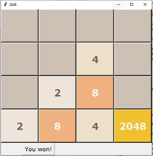
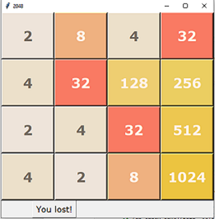

# 2048 game
 recreating the popular mobile game 2048 using python and Tkinter for GUI  
 includes the original class mode as well as a speed mode that adds a new tile every 2 seconds as an additional challenge !

 
